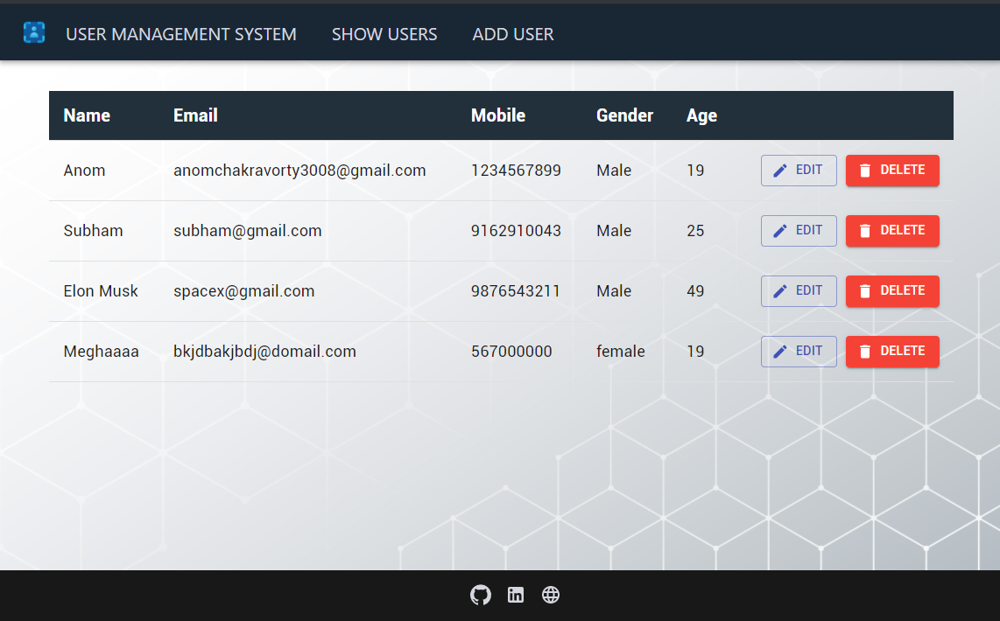
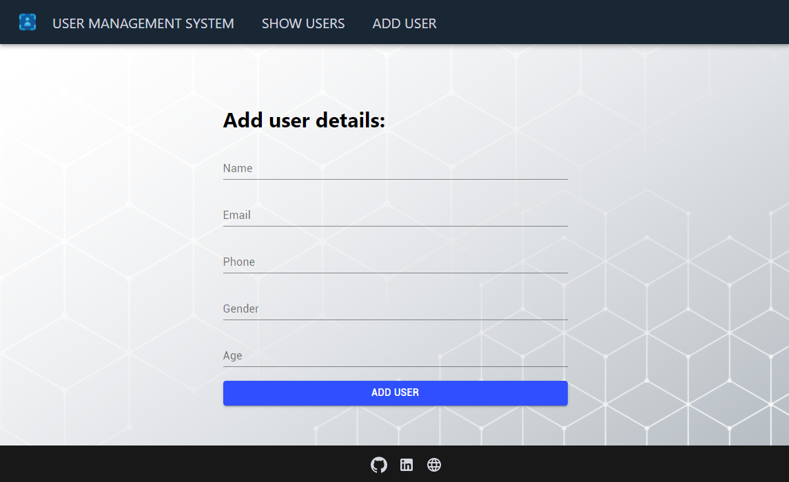
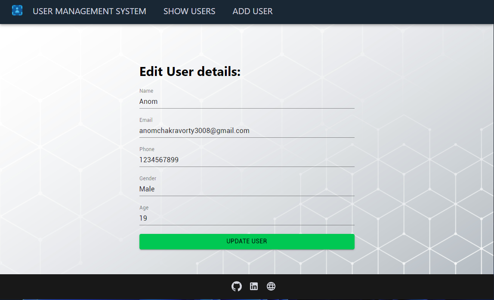

# User Management System (CRUD App)
Built with MERN (MongoDb, Express, React, Node) stack.
<a href="https://github.com/anomic30/CRUD-App-Backend">**Click me to see the backend code**</a> 

## Description:
A simple web app that manages all your user/customer information.
All information are being stored in MongoDb.
Will add authentication very soon...

## Check out the live site below:
<a href="https://user-management-anom.netlify.app/">**user-management-anom.netlify.app**</a> 

## Snapshots-

